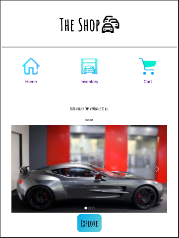

Website: [a link](https://the-shop007.herokuapp.com/)
Medium Article: [a link](https://medium.com/@brandegilbert/the-shop-luxury-car-e-commerce-store-3f221b16fe0c)

Since I can remember I've always loved cars. As I grew I started to develop a love for luxury cars. There are some cars that have been made that aren't accessible to everyday people because of cost and I'd like that to change so I created this luxury car e-commerce website.

The technologies I used were React, Redux, and styled components.

Home Page

On the Home page I used npm package React Simple Image Slider to add some images of the available cars in the store to a slideshow. I created links to three pages, Home, Inventory, and Cart and used icons to add some visuals to the page. I also added an explore button on the bottom which directs the user to the Inventory page.

Inventory Page

The inventory information is fetched from a supabase database. The information is then displayed on cards for the users. From this page users are able to add a car to their cart.

Cart Page

Users are able to remove a car from their cart and also see the subtotal of the cars in their cart.

This was my first project using React and Redux and I learned a lot. Prior to doing this project state management was much harder to understand but now that I have applied what I was learning I am much more comfortable with React and Redux.
